# Sorted

Sorted is a fly-tipping reporting and triage tool for councils, built in a one-day hackathon at the Labour Conference 2026. A resident photographs a pile of rubbish, an AI model running on the council's own hardware reads the photo, and the council's rules decide what happens next: send a crew, hold it for an officer to look for evidence, call in a specialist, or pass it to whoever owns the land.

The tool was built across about 8 hours by Multiverse Apprentices Sagal Qodah and Joe Williams with Pete Curran and a lot of Claude and a bit of Codex. 'Mersey Vale' council is fictional but its streets and boundaries are Liverpool's. Every report is simulated and every photo is AI-generated.

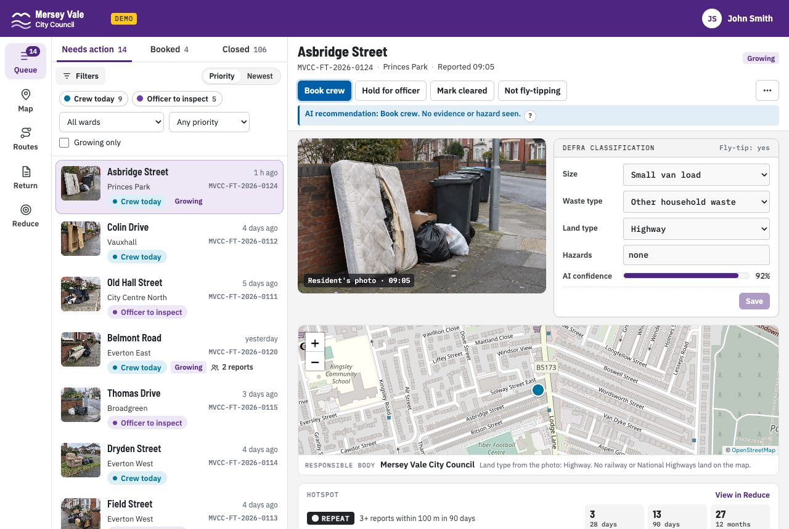

## Reporting it

A resident taps "Report fly-tipping" and takes a photo. If the photo has GPS in it, the pin drops by itself; if not, they use their phone's location or tap the map. The photo is re-saved without its hidden data before anyone sees it.

<table><tr>
<td>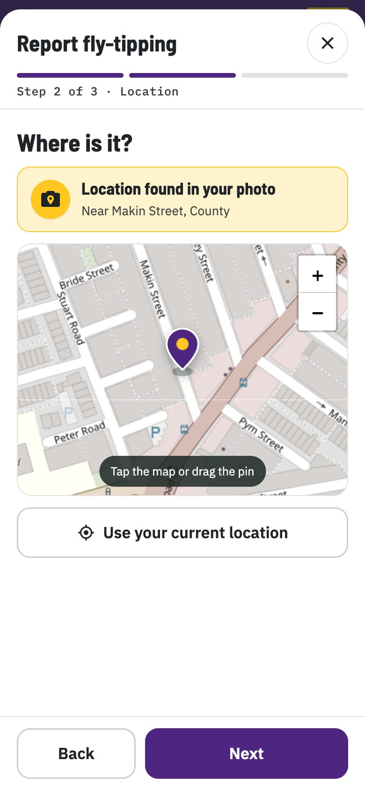</td>
<td>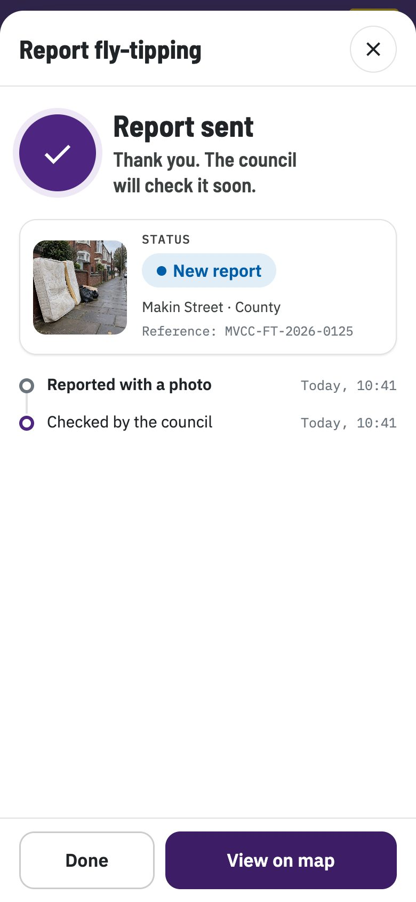</td>
</tr></table>

## Reading the photo, then applying the rules

The AI codes the photo the way DEFRA's WasteDataFlow return asks for it: size band, waste type, land type and any hazards. The decision then comes from the council's rules, which live in a file an officer can read and change:

- anything hazardous goes to a licensed specialist;
- black bags and trade waste are held for an officer, because they often have names and addresses in them;
- everything else goes to a crew.

The officer sees the photo, the AI's reading (which they can correct), the recommendation and why, and the rest of the case on one card.

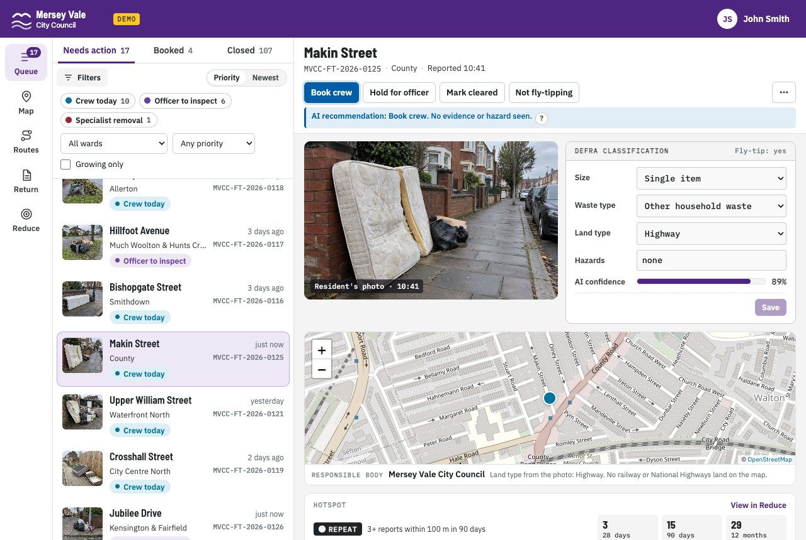

## Knowing what the photo can't show

A fridge on a pavement looks like fly-tipping. If a bulky collection is booked within 30 m of it today, it isn't, and Sorted closes it and keeps it off the crew's route. Hazards work the other way. Here the AI listed paint tins, so the rules sent the job to a specialist even though it looked like an ordinary small pile.

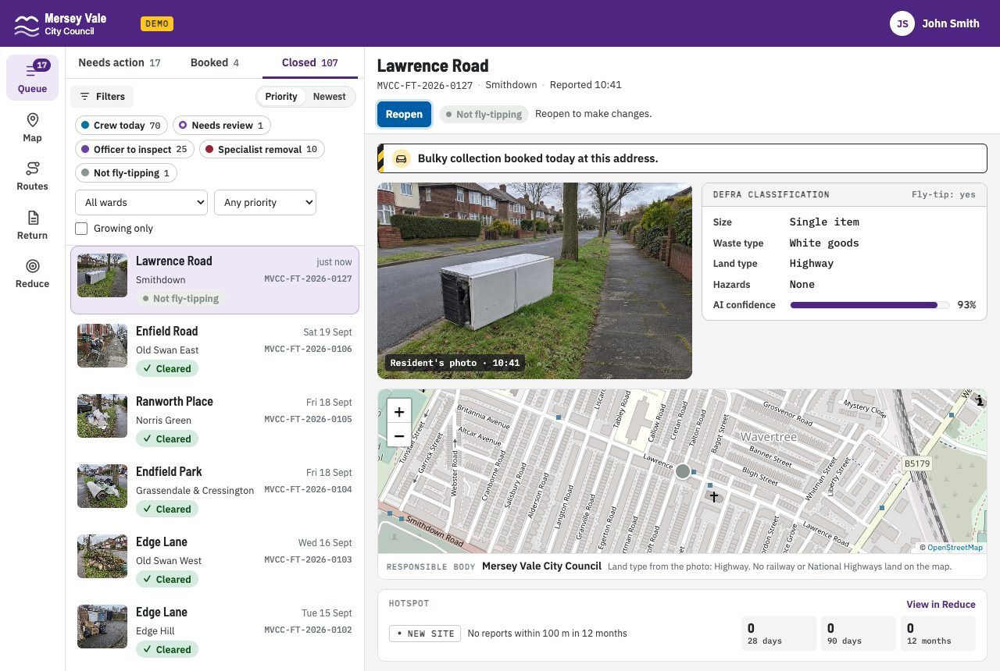

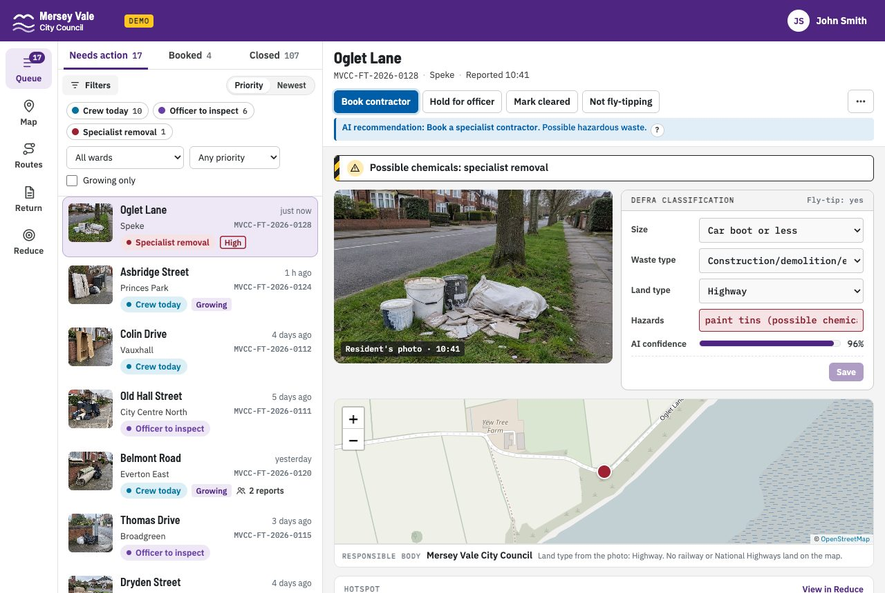

## Working out whose job it is

Plenty of fly-tipping isn't the council's to clear. Sorted checks the map. Within 20 m of railway land it's Network Rail's, on the motorways and trunk roads it's National Highways', and just over the boundary it belongs to the neighbouring council (Sefton, Knowsley, Wirral, St Helens or Halton). On private land, the landowner is responsible. The card says which, and under which law.

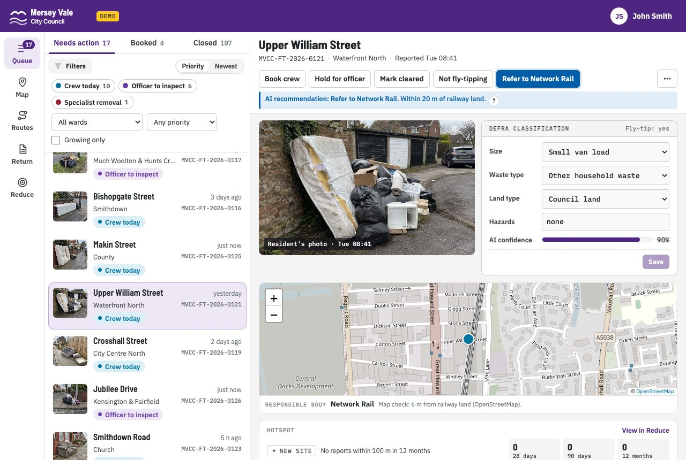

## Repeated reports are grouped

When a second person reports something within a few metres of an open report, the app shows both photos and asks if it's the same. If it is, their report counts as a "still there" confirmation instead of a duplicate, and repeated confirmations push the job up the queue.

<table><tr>
<td>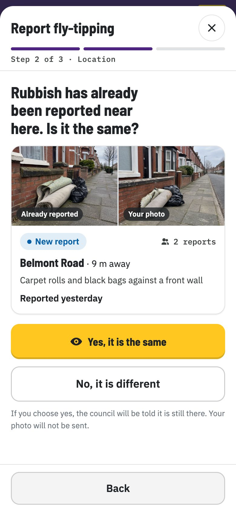</td>
<td>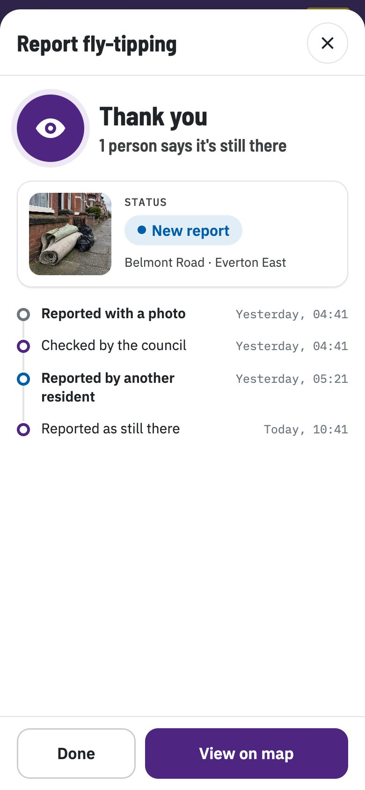</td>
</tr></table>

## What residents see

The public map shows open reports and their status. Residents can say whether something is still there, and they see a photo of the cleared site when it's done. They never see that an officer is involved: the statuses are New report, Crew booked, Further inspection, Passed on, Cleared and Closed.

<table><tr>
<td>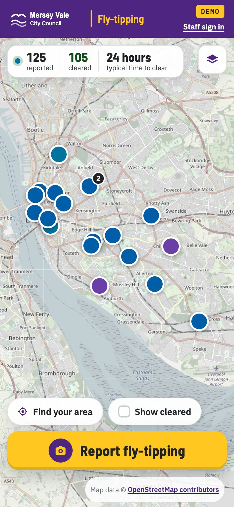</td>
<td>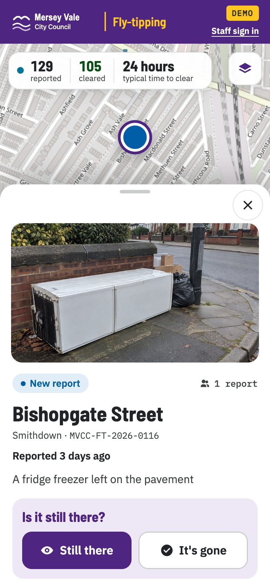</td>
</tr></table>

## Routes for the crew and the officer

Once jobs are booked, Sorted plans a route from the depot for the crew and another for the officer, urgent stops first. Each has a Google Maps link and a QR code to open it on a phone in the van.

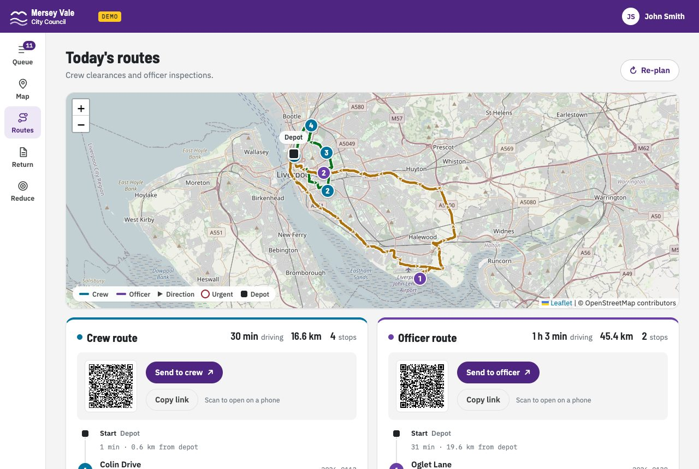

## The DEFRA return

Every council in England sends DEFRA a quarterly WasteDataFlow return of fly-tipping incidents, counted by land type, waste type and size, with the enforcement action taken. Sorted builds it from the records as they come in, and exports a CSV laid out like the form.

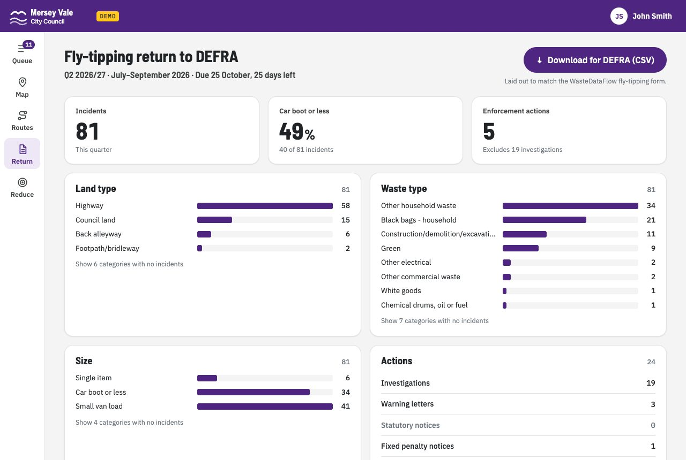

## Stopping it coming back

Fly-tipping repeats. Sorted finds the spots with the most reports in the last 90 days, shows a 12-week trend for each, and suggests one action, such as better lighting or fencing, clearing it quickly with "under investigation" signs, or a free bulky collection. The actions come from published research on what reduces repeat dumping.

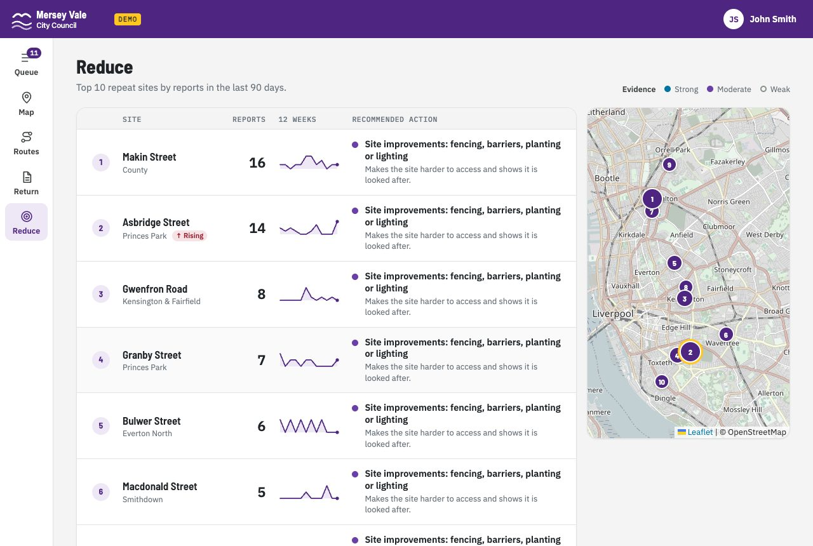

## How good is the AI?

It's Gemma 4 12B, running in 4-bit on an Apple M2 Pro laptop with 16 GB of memory, at about 14 seconds a photo. Nothing leaves the machine.

It's right about whether something is fly-tipping nearly every time, and weakest on size. The night before the demo we tuned the prompt against photos we'd labelled by eye, which took it from about 60% to over 80% on size for photos it hadn't seen, and from 9 to 11 out of 15 on a set of real-world photos. When it's wrong on size, it's almost always one band out. It also misses some hazards: it described paint tins as "metal cans" more than once. That's why the rules and a person sit on top of it.

## What it isn't

It's a demonstration. Before a council used anything like it, it would need real staff sign-in, proper data protection work (photos can show people and number plates), production map and routing services, and a trial on the council's own photos. `docs/TECHNICAL.md` goes into more detail.

## Running it yourself

You need [uv](https://docs.astral.sh/uv/), and an Apple silicon Mac if you want the AI to read your own photos. Elsewhere, it runs with the demo's photos only.

```bash
git clone https://github.com/petecurran/sorted.git
cd sorted
FT_RESET=1 scripts/run.sh
```

Then open http://localhost:8800. The council side is at http://localhost:8800/council, and any password works on your own machine. `seed/live_demo/` has five photos to try, with notes on what each one shows. `docs/TECHNICAL.md` covers how it fits together, the settings and the tests.

## Credits

Built by Sagal Qoda, Joe Williams and Pete Curran.

The code is under the MIT licence (`LICENSE`). The AI-generated photos and the simulated data are under CC BY 4.0. The map data, boundaries, DEFRA categories, the Leaflet map library, the fonts and the AI model belong to others and keep their own licences; `NOTICE.md` lists each one.
